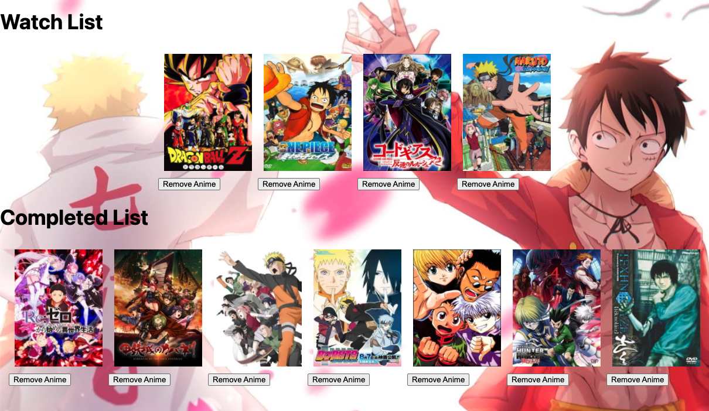

# AnimeHub!

AnimeHub is a place where you can browse your favorite anime, view it's details, add it to your watch/completed list to keep track of, and let others see, what you're interested in, as well as the ability to leave comments on any anime on your and others list so that everyone can share their opinion and insights!

 what're you waiting for, [start browsing, adding, and commenting!](https://animehubproject.herokuapp.com)  

## The website ⬇

### Home
If a person wishes to search for an anime of their liking, they will have to sign up using their google account.
 

### Search for any anime!
 

### Spec list
 
 
### Add to watchlist/completedlist
A user has the ability to add any anime while browsing to their watchlist or completed list

 

 ### View other profiles
 A user can view all the profiles that have signed up so far, and view their watch/completed list.

 

 ### Comment!
A user can comment on an anime they've added to their list, and also has the ability to comment on other peoples anime that they've added to their list.

 

 

## Trello Planning
 [Trello plan](https://trello.com/b/GIVpTnrl/unit-2-project)

## Technologies Used 🖥 :
* JavaScript
* HTML
* EJS
* CSS
* Node.js
* Express
* MongoDB
* Mongoose 

 ## Sources and Credits
 Anime data sourced from [Jikan API](https://jikan.docs.apiary.io/#introduction/information/links)  
 Search bar [Albert Feynman](https://codepen.io/AlbertFeynman/pen/BPvzWZ)

 ## Next Steps
 * Ability to view a pop up of the anime spec list
 * Toggle between light and dark mode
 * Ability to filter anime by most/lowest watched and highest/lowest ratings
 * Search for anime by genre